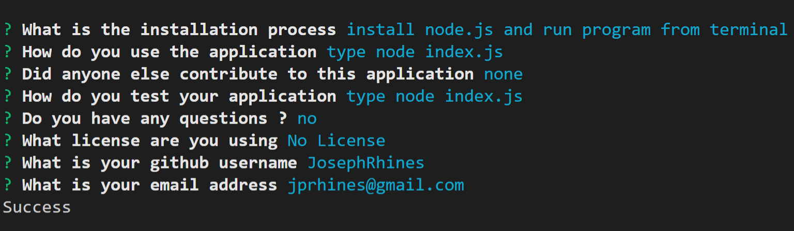

# Readme-Generator

## Description:
 Application That Generates a Readme.md File

## Tools:
  * node.js 
   
  * inquirer
   
  * fs

## User Story:
The User is prompted with a series of questions that require the user to input information.
After the series of questions are completed the user information is used to create a readme file.

## Screenshot Of Application:

## Links:
https://github.com/JosephRhines/Readme-Generator
 
https://drive.google.com/file/d/1kK3reFDujaISnziLueFrDVLwkcUU_xof/view

